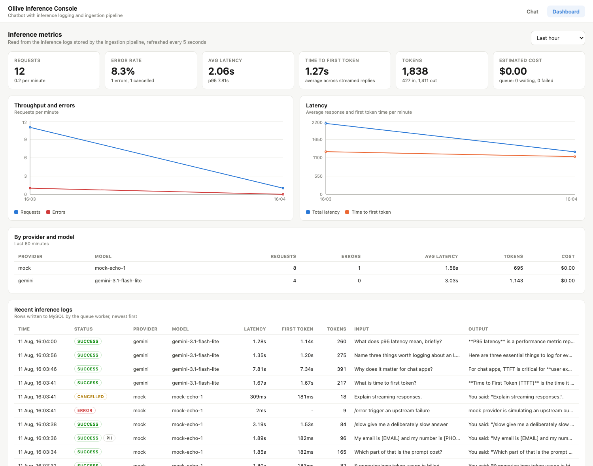
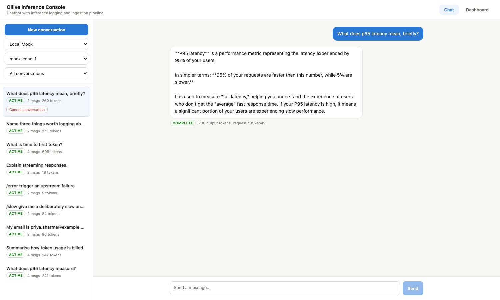
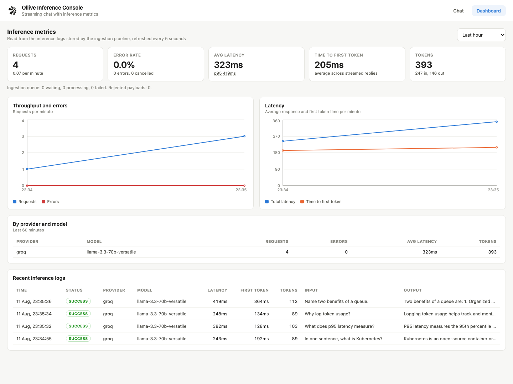

# Ollive — Inference Logging and Ingestion System

A streaming chatbot with an inference logging pipeline around it. Every LLM call is
wrapped by a small SDK that captures metadata (latency, tokens, status, cost) and
posts it to an ingestion API. The ingestion API validates the payload and pushes it
to a Redis queue, a worker stores it in MySQL, and a dashboard reads it back.

Tech stack: Node.js, Express, Sequelize, MySQL, Redis (BullMQ), React, Vite, Recharts.





## Project structure

```
server/          Express API, ingestion API and queue worker
client/          React app (chat + dashboard)
k8s/             Kubernetes manifests
docker-compose.yml
```

The server follows a module based MVC structure:

```
server/
  server.js                  API process
  worker.js                  queue worker process
  src/
    app.js                   express app setup
    config/                  env config, sequelize, redis
    constants/               enums and shared values
    models/                  sequelize models
    middlewares/             validate, api key, session, error handler
    modules/
      chat/                  streaming chat (routes, controller, service, validation)
      conversation/          create, list, resume, cancel
      logs/                  ingestion API + storage service
      metrics/               dashboard queries
    providers/               openai, groq, anthropic, gemini
    sdk/                     inference logger, PII redaction, pricing
    queue/                   BullMQ queue and worker processor
    utils/                   logger, api response, sse, helpers
    scripts/                 db sync, sample data seeder
    routes/index.js          mounts all module routes under /api
```

## Setup

### Option 1: Docker Compose

Put at least one provider key in `server/.env` first (see below), then:

```bash
docker compose --env-file server/.env up --build
```

Open http://localhost:3000.

The `--env-file` flag matters: `server/.env` is the single source of truth, and the
compose file pulls the app variables from it via `env_file` while overriding only the
host-specific ones (`DB_HOST=mysql`, `REDIS_HOST=redis`). Without the flag, the
`${...}` substitutions for the MySQL container fall back to defaults and the
password will not match.

### Option 2: Run locally

You need Node 20+, MySQL 8+ and Redis running locally.

**Server**

```bash
cd server
cp .env.example .env      # set DB_PASSWORD
npm install
npm run db:sync           # creates the database and tables
npm run dev               # API on http://localhost:5000
npm run worker:dev        # in another terminal
```

**Client**

```bash
cd client
npm install
npm run dev               # http://localhost:5173
```

**Sample data (optional)**

```bash
cd server
npm run seed
```

This sends a few conversations through the real API, including one stream that is
cancelled part way through, so the dashboard has something to show.

### Using a real provider

Add a key to `server/.env`, restart the server, and pick the provider in the UI
dropdown:

```
GROQ_API_KEY=gsk_...
GEMINI_API_KEY=...
OPENAI_API_KEY=sk-...
ANTHROPIC_API_KEY=sk-ant-...
```

**Groq and Gemini are the two I tested against live**, both on free keys —
[Groq console](https://console.groq.com/keys) and
[Google AI Studio](https://aistudio.google.com/apikey). Neither needs a card.

Groq is the better one to demo with: measured against this pipeline it returns in
150–330ms with 110–160ms to first token, and streams in many small chunks, so the
token-by-token effect is obvious. Gemini takes 1.3–2.6s and sends far fewer, larger
chunks.

### Adding an OpenAI-compatible provider without writing code

`openAiCompatible.js` holds the shared request and stream-parsing logic, and both
`openai.provider.js` and `groq.provider.js` are ten-line config objects around it.
Base URLs are environment driven:

```
GROQ_BASE_URL=https://api.groq.com/openai/v1
OPENAI_BASE_URL=https://api.openai.com/v1
```

So OpenRouter, Together, Fireworks or a local Ollama can be pointed at by config
alone. Anthropic and Gemini keep their own provider files because their wire
formats genuinely differ — Anthropic splits usage across `message_start` and
`message_delta`, Gemini reports it in `usageMetadata`.

**Model ids are configurable, not hardcoded.** Provider model names get retired
fairly often, so each provider reads its list from the environment and only falls
back to a default:

```
GROQ_MODELS=llama-3.3-70b-versatile,llama-3.1-8b-instant,openai/gpt-oss-20b
GEMINI_MODELS=gemini-3.1-flash-lite,gemini-3.5-flash,gemini-3.6-flash
OPENAI_MODELS=gpt-4.1-mini,gpt-4o-mini
ANTHROPIC_MODELS=claude-sonnet-4-5,claude-haiku-4-5
```

I moved these into config after hitting it in practice: the model ids I first wrote
had already been retired, and Gemini's own `ListModels` endpoint still advertised
them while `streamGenerateContent` returned 404. Now a retired model is a one line
env change instead of a code change. Every id above was checked against the
provider's live models endpoint and then confirmed with a real streaming call.

### Output token limits are per provider, and that matters

`MAX_OUTPUT_TOKENS` (1024) applies to the OpenAI-compatible providers and Anthropic.
Gemini gets its own `GEMINI_MAX_OUTPUT_TOKENS` (3072).

They are separate because a single shared value breaks one provider or the other.
Gemini needs a high ceiling since reasoning tokens count against it. But Groq
reserves the **requested** `max_tokens` against its 6,000 tokens-per-minute free
quota rather than the tokens actually used — so sending 3072 meant roughly two
requests per minute before hitting `429`. Seeding sample data produced 4 rate-limit
errors out of 7 calls. Splitting the setting took that to 0 out of 7.

### Two Gemini specific notes

**`MAX_OUTPUT_TOKENS` defaults to 3072, not 1024.** Gemini 3.x models reason before
answering, and `maxOutputTokens` caps reasoning *plus* the answer. At 1024 the model
spent about 670 tokens thinking, leaving ~26 for the reply, and every answer came
back truncated with `finishReason: MAX_TOKENS`. The provider also sends
`thinkingLevel: low` (`GEMINI_THINKING_LEVEL`) to keep reasoning cheap, since
`thinkingBudget: 0` is rejected with a 400 on these models.

**Free tier quota is per model, per day.** If one model starts returning 429 the
others usually still work, so switching model in the dropdown is the workaround.
Rate limits are logged as `provider_429`, separately from other provider failures,
so a throttle is distinguishable from an outage on the dashboard.

**Reasoning tokens are counted as output tokens.** Gemini reports them separately as
`thoughtsTokenCount`, but they are billed like output, so the provider adds them to
`completionTokens`. Otherwise the dashboard would understate real usage. This means
completion tokens can exceed what the visible reply would suggest.

## How it works

```
React client
    |  POST /api/conversations/:uuid/messages   (SSE response)
    v
Express chat service ------> LLM provider (streaming)
    |                              |
    | saves conversation           | inference SDK measures the call
    | and messages to MySQL        v
    |                        POST /api/logs  (ingestion API)
    |                              |
    |                              v
    |                        validate with Joi
    |                              |
    |                              v
    |                        Redis queue (BullMQ)
    |                              |
    |                              v
    |                        worker.js -> MySQL inference_logs
    v
MySQL <---------------------- dashboard queries
```

Two things happen for every message:

1. The chat service saves the conversation and messages itself and streams tokens
   to the browser over SSE.
2. The inference SDK measures the same call and posts the log to the ingestion API.
   This is not awaited by the request, so a slow or broken logging pipeline never
   affects the chat.

The two sides are linked by `requestId`, which is generated before the call and
saved on the assistant message row.

More detail in [ARCHITECTURE.md](ARCHITECTURE.md).

## The inference SDK

`server/src/sdk/inferenceLogger.js` wraps an LLM call and captures its metadata.
The chat service uses it like this:

```js
const tracker = startInference({ requestId, conversationUuid, provider, model, inputText });

for await (const chunk of provider.streamChat({ model, messages, signal })) {
    tracker.markFirstToken();
    // stream the chunk to the browser
}

tracker.finish({ status: 'success', outputText, usage, chunkCount });
```

The tracker handles timing, token counting, cost estimation, PII redaction and
delivery to the ingestion API. The chat service only says what happened.

What gets captured: provider, model, status, latency, time to first token, prompt
and completion tokens, estimated cost, input and output previews, error type and
message, PII flag, and the conversation, session and message ids.

If the provider does not report token usage, the SDK estimates it from the text
length and sets `metadata.tokenSource` to `estimated`, so an estimate is never
mistaken for a real number.

A cancelled stream is stored as `cancelled`, not as an error. The partial answer
and the tokens actually generated are still saved, because the tokens were still
spent.

## PII redaction

`server/src/sdk/redact.js` masks emails, phone numbers, card numbers, Aadhaar, PAN
and API keys. It runs in two places:

1. In the SDK, before the log leaves the process, so raw PII never reaches the
   queue or the logs table.
2. Again in the ingestion service when the log is stored, because the SDK is a
   library that another service could use with redaction turned off.

Chat messages in the `messages` table are stored as the user typed them, since that
is the product data they expect to see when they reopen a conversation. Redaction
applies to the logging copy.

## API

All routes are under `/api`.

| Method | Route | Description |
|---|---|---|
| GET | `/providers` | Available providers, models and which have keys |
| POST | `/conversations` | Create a conversation |
| GET | `/conversations` | List conversations (`?status=`, `?limit=`, `?mine=true`) |
| GET | `/conversations/:uuid` | Conversation with all messages (resume) |
| POST | `/conversations/:uuid/cancel` | Cancel a conversation |
| POST | `/conversations/:uuid/messages` | Send a message, reply streams over SSE |
| POST | `/logs` | Ingestion endpoint, needs `x-api-key` |
| GET | `/metrics/overview` | Totals, error rate, p95, tokens, cost, per model breakdown |
| GET | `/metrics/timeseries` | Per minute points for the charts |
| GET | `/metrics/logs` | Recent inference logs |

The SSE stream sends four event types: `meta` (ids, provider, model), `delta`
(token text), `done` and `error`.

To cancel a running reply the client just aborts the request. The server sees the
response close, aborts the provider call, saves the partial message as `cancelled`,
and the SDK logs it as cancelled.

## Database schema

Four tables, defined as Sequelize models in `server/src/models`.

**conversations** — uuid, sessionId, title, status (active / cancelled / archived),
provider, model, messageCount, totalTokens, lastMessageAt.

**messages** — uuid, conversationId, role, content, status (streaming / complete /
cancelled / failed), tokenCount, requestId.

**inference_logs** — requestId (unique), conversationUuid, messageUuid, sessionId,
provider, model, status, latencyMs, timeToFirstTokenMs, promptTokens,
completionTokens, totalTokens, costUsd, errorType, errorMessage, inputPreview,
outputPreview, piiRedacted, metadata (JSON), startedAt, finishedAt.

**failed_logs** — payloads that could not be stored, with the reason.

Decisions worth calling out:

- **Internal auto increment ids, public UUIDs.** Joins use the integer id, but every
  API response returns the uuid. Numeric ids are never exposed.
- **`inference_logs` is not foreign keyed to conversations or messages.** Logs
  arrive asynchronously and can arrive late, so a foreign key would either fail the
  insert or force logging into the chat transaction. It stores
  `conversationUuid` / `messageUuid` as plain references instead.
- **`requestId` is unique.** BullMQ jobs use the requestId as the job id and the
  worker checks for an existing row before inserting, so a retried job cannot
  create a duplicate log.
- **`metadata` is a JSON column.** Extra fields like `tokenSource`,
  `tokensPerSecond` and `redactedLabels` change often, and putting them in JSON
  avoids a migration every time something is added.
- **Message content is TEXT, previews are VARCHAR(512).** Full replies can be long,
  but the log only keeps a short preview, which keeps the logs table small and
  limits how much sensitive text is copied.

## Tradeoffs

- **MySQL instead of Postgres.** Postgres has better JSON indexing and native
  percentile functions. I picked MySQL because I know it well, and p95 is small
  enough to calculate in the service layer.
- **BullMQ instead of Kafka.** BullMQ gives retries, backoff, concurrency and job
  dedupe out of the box and needs only Redis. Kafka would make sense at much higher
  volume or with multiple consumer groups.
- **Ingestion API lives in the same Express app as the chat API.** The SDK still
  talks to it over HTTP, so it can be split into its own service later without
  changing the SDK. Running it separately now would just add a deployment for no
  benefit at this size.
- **`sequelize.sync()` instead of migration files.** Faster for a project this
  size. A real deployment should use `sequelize-cli` migrations, because `sync` can
  not do safe column renames or data backfills.
- **Metrics are calculated from raw logs on every request.** Simple and accurate,
  but it scans the window each time. The dashboard also loads latency values into
  the service to work out p95.
- **Logs are sent one at a time, not batched.** Simpler and genuinely real time. At
  high traffic this should be batched.
- **The price table only covers models whose rates I could confirm.** Anything not
  listed in `server/src/sdk/pricing.js` reports `$0`, which is correct on the Gemini
  free tier but would understate a paid plan. I chose a visible zero over invented
  numbers on a cost dashboard, but adding a model does mean adding its rate.
- **Cost is estimated from a hardcoded price table**, so it will drift from real
  provider billing.

## What I would improve with more time

- **Tests.** Nothing is automated yet. First targets would be the SDK payload
  building, the redaction rules, and the worker's duplicate check.
- **Pre-aggregated metrics.** A per minute summary table written by the worker
  would keep the dashboard fast as the logs table grows, instead of aggregating raw
  rows on every request.
- **Batch the log delivery** and add a small retry buffer in the SDK, so a restart
  cannot lose the logs currently in flight.
- **Proper migrations** with sequelize-cli.
- **Retention** on `inference_logs`, probably partitioning by day and dropping old
  partitions.
- **Auth.** There is no login. Conversations are grouped by a session id kept in
  localStorage, which is enough for a demo but not for real users.
- **A retry screen for `failed_logs`**, since right now they are only stored.
- **Rate limiting** on the ingestion endpoint.

## Kubernetes

Verified on a local k3s cluster (Colima). Five deployments, 8 pods:

```bash
docker build -t ollive/server:latest ./server
docker build -t ollive/client:latest ./client

kubectl apply -f k8s/infra.yaml
kubectl apply -f k8s/app.yaml
kubectl -n ollive rollout status deploy/server
kubectl -n ollive get pods
```

Replace the placeholder values in the `app-secrets` Secret before applying, or create
it from your real values:

```bash
kubectl -n ollive create secret generic app-secrets \
  --from-literal=DB_PASSWORD=... \
  --from-literal=INGESTION_API_KEY=... \
  --from-literal=GROQ_API_KEY=... \
  --dry-run=client -o yaml | kubectl apply -f -
```

`k8s/infra.yaml` holds the namespace, ConfigMap, Secret, MySQL with a PVC, and Redis.
`k8s/app.yaml` holds the server, worker (with an HPA), client and an Ingress.

Three details worth noting:

- **The server Deployment runs `npm run db:sync` as an initContainer**, so tables
  exist before the app starts. Deployments do not wait for Jobs, so an initContainer
  is the simpler way to gate startup.
- **`imagePullPolicy: IfNotPresent`** on every container. Without it, a `:latest` tag
  makes Kubernetes try to pull from Docker Hub and fail on locally built images.
- **The Ingress targets an nginx ingress controller** with response buffering
  disabled, which SSE needs. k3s ships Traefik instead, so on k3s either install
  nginx-ingress or reach the app with
  `kubectl -n ollive port-forward svc/client 8080:80` — which is how the run below
  was verified.

Confirmed working in-cluster: a real Groq call streamed 25 chunks through the client
pod's nginx to the server pod, the worker pod stored the log in the MySQL pod, and
the dashboard read it back.



```
NAME                          READY   STATUS    RESTARTS   AGE
pod/client-7dbc7bc4c9-mzhzp   1/1     Running   0          2m6s
pod/client-7dbc7bc4c9-vbwvh   1/1     Running   0          2m6s
pod/mysql-b45bc49f9-5lksw     1/1     Running   0          2m20s
pod/redis-6ddf79b9bc-df2sc    1/1     Running   0          2m20s
pod/server-785d9696c4-2f6rf   1/1     Running   0          2m6s
pod/server-785d9696c4-l4r2w   1/1     Running   0          2m6s
pod/worker-655959bfdc-8vmq8   1/1     Running   0          2m6s
pod/worker-655959bfdc-drhrl   1/1     Running   0          2m6s

NAME                                         REFERENCE           TARGETS       MINPODS   MAXPODS   REPLICAS
horizontalpodautoscaler.autoscaling/worker   Deployment/worker   cpu: 1%/70%   2         8         2

NAME                               CLASS   HOSTS          PORTS
ingress.networking.k8s.io/ollive   nginx   ollive.local   80

NAME                               STATUS   CAPACITY   ACCESS MODES   STORAGECLASS
persistentvolumeclaim/mysql-data   Bound    10Gi       RWO            local-path
```

## Generating sample data

`npm run seed` sends a handful of conversations through the real API so the
dashboard has something to show, including one stream that is cancelled part way
through.

Error rows appear when a real failure happens rather than being simulated. The
easiest way to produce one on demand is to exceed a provider's rate limit, which is
stored as `provider_429` and is distinct from other provider failures.
# Chatbot-application
AI Chatbot With Multiple Provider
